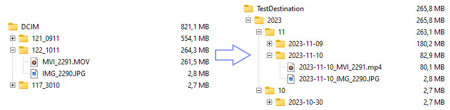

<!---
SPDX-FileCopyrightText: 2023 Maik Fox <maik.fox@gmail.com>

SPDX-License-Identifier: EUPL-1.2
-->

# import_converter

The import_converter copies and organizes media files from a source (e.g. a memory card of a digital camera) and reencodes the movies using handbrake.

The import_converter repository follows the [REUSE Software Specification](https://reuse.software/spec/) for license attribution.

## Why does this tool exist?

My son got an older digital camera from his grandparents. Once the first memory card was full, I needed to come up with a way of getting his photos and videos off the card in an organized manner. Also, as my sons likes to take videos, it became very clear that the old camera's video files were unreasonably large due to uncompressed audio and wasteful video settings.

To avoid installing some proprietary and old camera model specific software to copy the files from the memory card and manually reencoding the video files every time, this small tool was created. It also served as an exercise for learning Rust.

## Build

The import_converter builds with `cargo build` (debug build) respectively `cargo build --release` (release build) and is currently tested only using Windows and debian within WSL (Windows Subsystem for Linux).

## Usage

The import_converter loads its settings from different sources in the following order:
1. `icsettings.toml` in the same directory
1. `icsettings-user.toml` in the same directory
1. environment variables (setting names from `icsettings.toml` and prefixed with `ICONV_`)

The individual settings take priority over the ones read earlier, meaning a setting in `icsettings-user.toml` overwrites a setting made in `icsettings.toml`.

The import_converter does currently not support any commandline arguments.

The tool depends on a version of [handbrakeCLI](https://handbrake.fr/downloads2.php) being available locally and its path configured properly in the settings file.

Run the tool using cargo, e.g. by using `cargo run` (run debug build) respectively `cargo run --release` (run release build) in the project directory.

### Windows specifics

**Note:** All paths needs to use `\` and they need to be escaped properly in the settings file, e.g. `source = "D:\\DCIM"`. This applies to the following settings:

* directories.source
* directories.destination
* organisation.path_format

The [handbrakeCLI](https://handbrake.fr/downloads2.php) just needs to be downloaded and extracted. The path in the respective config file needs to point where `HandBrakeCLI.exe` is located.

### Linux specifics

**Note:** This has so far only been tested under Windows Subsystem for Linux (WSL) using Debian.

**Note:** All paths needs to use `/` and they need to be escaped properly in the settings file, e.g. `source = "/mnt/media/sdcard/DCIM"`. This applies to the following settings:

* directories.source
* directories.destination
* organisation.path_format

#### apt

* At least for a current debian, all that is needed is `apt install handbrake-CLI`.
* After successful installation, the `HandBrakeCLI` command is available and can be configured in the `import_converter` settings, e.g. `handbrakeCLI = "HandBrakeCLI"`.

#### Flatpak (not tested)

The installation and usage of [handbrakeCLI](https://handbrake.fr/downloads2.php) is slightly more involved due to the use of the [flatpak](https://flatpak.org/) install system.

* install flatpak on your system. For a current debian, this can be achieved using `suda apt install flatpak`.
* install HandBrake or HandBrakeCLI according to the [instructions](https://handbrake.fr/docs/en/latest/get-handbrake/download-and-install.html)
* configure the path using one of the exports made available by flatpak, e.g. in `/var/lib/flatpak/exports/bin`

#### Using HandBrakeCLI in Linux environments

This [article](https://www.linux.com/training-tutorials/how-convert-videos-linux-using-command-line/) gives some insights into using the HandBrakeCLI in Linux environments.

## Operation

The import_convertor will search all files, with the extensions specified for copying and reencoding, that are located in the source directory. The tool also tries to read a creation date and time from the file, using EXIF (for images) and mp4 metadata (for videos).

All files will be, depending on their file extension, either copied or reencoded using handbrake.

The destination folders and file name prefixes can be freely configured based on the file's creation date.

For testing the settings, a dry-run can be configured that stops before files are being copied or encoded.

## Configuration

All the settings go in one of the settings files in the [toml format](https://toml.io/en/v1.0.0).

### General Options

    [options]
    # stop befory any actual copy or reencode is executed
    dry-run = true
    # delete_source_files is not yet implemented
    delete_source_files = false

### Source and destination directories

Both directories do not need a trailing backslash (resp. slah) at the end.

Backslashes, however, need to be properly escaped in the [toml format](https://toml.io/en/v1.0.0).

    [directories]
    # use the correct folder divider here as well: \\ for windows (escaped \), / for linux
    # source directory where the files are found (e.g. path to memory card)
    source = "D:\\DCIM"
    # destination directory for the new structure and the copied/reencoded files
    destination = "C:\\myCloudFolder\\Photos"

### File extensions for copying and encoding

    [extensions]
    # array of file extensions that should be copied respectively reencoded.
    # can be case-sensitive on your system.
    # for advanced use cases, masks more advanced than *. can be defined here,
    # the tool however does not check if a single files is matched (and thus
    # processed) multiple times
    copy = ["*.JPG", "*.JPEG"]
    reencode = ["*.MOV"]

### Destination file organisation

Both directories and filename prefixes are formatted using the [Rust chrono strftime options](https://docs.rs/chrono/latest/chrono/format/strftime/index.html).

    [organisation]
    # define a path format for the folder structure used
    # use the correct folder divider here as well: \\ for windows (escaped \), / for linux
    # https://docs.rs/chrono/latest/chrono/format/strftime/index.html
    path_format = "%Y\\%m\\%Y-%m-%d"
    # defines a filename prefix, can also be empty
    # https://docs.rs/chrono/latest/chrono/format/strftime/index.html
    filename_prefix ="%Y-%m-%d_"

### Reencoding settings

Using [handbrakeCLI](https://handbrake.fr/downloads2.php), a variety of options ([intro](https://handbrake.fr/docs/en/latest/cli/cli-options.html) and [full reference](https://handbrake.fr/docs/en/latest/cli/command-line-reference.html)) can be configured for the reencoding step. For experimentation, it's probably easier to use the full [handbrake](https://handbrake.fr/) GUI tool and load an example file of your source to determine the suitable reencoding suiting your needs.

    [encoding]
    # path to local handbrakeCLI executable
    # use the correct folder divider here as well: \\ for windows (escaped \), / for linux
    handbrakeCLI = "C:\\temp\\HandBrakeCLI-1.7.1-win-x86_64\\HandBrakeCLI.exe"
    # handbrake CLI options for encoding
    # https://handbrake.fr/docs/en/latest/cli/cli-options.html
    # https://handbrake.fr/docs/en/latest/cli/command-line-reference.html
    options = "-e nvenc_h264 -q 22 -B 160"
    # change file extension to the following for the output file
    new_file_extension = "mp4"

## Example run

The tool indicates the source of the "taken" (creation date) information in brackets for each file.

    import_converter
    *.JPG --> reencode: false
    *.JPEG --> reencode: false
    *.MOV --> reencode: true
    collecting files...
    found 18 files (total of 821.11 MB):
    D:\DCIM\117_3010\IMG_2256.JPG (0.89 MB) - taken 2023-10-30T18:12:25 (EXIF) --> D:\myCloudFolder\Photos\2023\10\2023-10-30\2023-10-30_IMG_2256.JPG (copy)
    D:\DCIM\117_3010\IMG_2257.JPG (0.90 MB) - taken 2023-10-30T18:14:04 (EXIF) --> D:\myCloudFolder\Photos\2023\10\2023-10-30\2023-10-30_IMG_2257.JPG (copy)
    D:\DCIM\117_3010\IMG_2258.JPG (0.89 MB) - taken 2023-10-30T18:14:29 (EXIF) --> D:\myCloudFolder\Photos\2023\10\2023-10-30\2023-10-30_IMG_2258.JPG (copy)
    D:\DCIM\121_0911\IMG_2272.JPG (0.93 MB) - taken 2023-11-09T19:31:57 (EXIF) --> D:\myCloudFolder\Photos\2023\11\2023-11-09\2023-11-09_IMG_2272.JPG (copy)
    D:\DCIM\121_0911\IMG_2273.JPG (0.64 MB) - taken 2023-11-09T19:32:18 (EXIF) --> D:\myCloudFolder\Photos\2023\11\2023-11-09\2023-11-09_IMG_2273.JPG (copy)
    D:\DCIM\121_0911\IMG_2274.JPG (0.80 MB) - taken 2023-11-09T19:32:45 (EXIF) --> D:\myCloudFolder\Photos\2023\11\2023-11-09\2023-11-09_IMG_2274.JPG (copy)
    D:\DCIM\121_0911\IMG_2275.JPG (0.88 MB) - taken 2023-11-09T19:33:02 (EXIF) --> D:\myCloudFolder\Photos\2023\11\2023-11-09\2023-11-09_IMG_2275.JPG (copy)
    D:\DCIM\121_0911\IMG_2276.JPG (0.74 MB) - taken 2023-11-09T19:33:21 (EXIF) --> D:\myCloudFolder\Photos\2023\11\2023-11-09\2023-11-09_IMG_2276.JPG (copy)
    D:\DCIM\121_0911\IMG_2277.JPG (0.30 MB) - taken 2023-11-09T19:33:27 (EXIF) --> D:\myCloudFolder\Photos\2023\11\2023-11-09\2023-11-09_IMG_2277.JPG (copy)
    D:\DCIM\121_0911\IMG_2278.JPG (0.78 MB) - taken 2023-11-09T19:38:53 (EXIF) --> D:\myCloudFolder\Photos\2023\11\2023-11-09\2023-11-09_IMG_2278.JPG (copy)
    D:\DCIM\121_0911\IMG_2279.JPG (0.88 MB) - taken 2023-11-09T19:39:05 (EXIF) --> D:\myCloudFolder\Photos\2023\11\2023-11-09\2023-11-09_IMG_2279.JPG (copy)
    D:\DCIM\121_0911\IMG_2280.JPG (0.36 MB) - taken 2023-11-09T19:39:20 (EXIF) --> D:\myCloudFolder\Photos\2023\11\2023-11-09\2023-11-09_IMG_2280.JPG (copy)
    D:\DCIM\121_0911\IMG_2281.JPG (0.88 MB) - taken 2023-11-09T19:39:56 (EXIF) --> D:\myCloudFolder\Photos\2023\11\2023-11-09\2023-11-09_IMG_2281.JPG (copy)
    D:\DCIM\121_0911\IMG_2282.JPG (0.73 MB) - taken 2023-11-09T20:03:28 (EXIF) --> D:\myCloudFolder\Photos\2023\11\2023-11-09\2023-11-09_IMG_2282.JPG (copy)
    D:\DCIM\122_1011\IMG_2290.JPG (2.81 MB) - taken 2023-11-10T19:31:00 (EXIF) --> D:\myCloudFolder\Photos\2023\11\2023-11-10\2023-11-10_IMG_2290.JPG (copy)
    D:\DCIM\121_0911\MVI_2283.MOV (165.55 MB) - taken 2023-11-09T21:06:36 (MP4 Metadata) --> D:\myCloudFolder\Photos\2023\11\2023-11-09\2023-11-09_MVI_2283.mp4 (reencode)
    D:\DCIM\121_0911\MVI_2284.MOV (380.64 MB) - taken 2023-11-09T21:10:24 (MP4 Metadata) --> D:\myCloudFolder\Photos\2023\11\2023-11-09\2023-11-09_MVI_2284.mp4 (reencode)
    D:\DCIM\122_1011\MVI_2291.MOV (261.51 MB) - taken 2023-11-10T20:31:17 (MP4 Metadata) --> D:\myCloudFolder\Photos\2023\11\2023-11-10\2023-11-10_MVI_2291.mp4 (reencode)
    Dry run configured --> exiting.

At the end of a normal run (not a dry run), statistics are displayed:

    __Summary__
    Total number of files: 18, of these successfuly processed: 18
    Copy:     success count: 15, fail count: 0
    Reencode: success count: 3, fail count: 0
    Filesize: before: 821.11 MB, after: 265.80 MB

## Known issues and future work

 * The crate [mp4](https://crates.io/crates/mp4) used to read the mp4 container metadata has several unfixed issues in 0.14.0, directly affecting the author's camera's movie files. These issues are fixed in the master branch of the crate's repository, which is used in the `Cargo.toml` for now. This will be remediated once 0.15.0 has been released.
 * The "delete source files after successful operation" feature is not implemented yet. The user has to verify correct tool execution and delete the source files manually, if desired.
 * The tool, on purpose, crashes when settings are missing or runtime errors are encountered.
 * There are no tests.
 * It has all the qualities of a "developer is new to Rust and built this in 3 days" project. Usage of advanced techniques and features of Rust would likely make the code much more enjoyable.
 * Only tested on Windows and debian within WSL (Windows Subsystem for Linux).
 * It might just not work for you.
